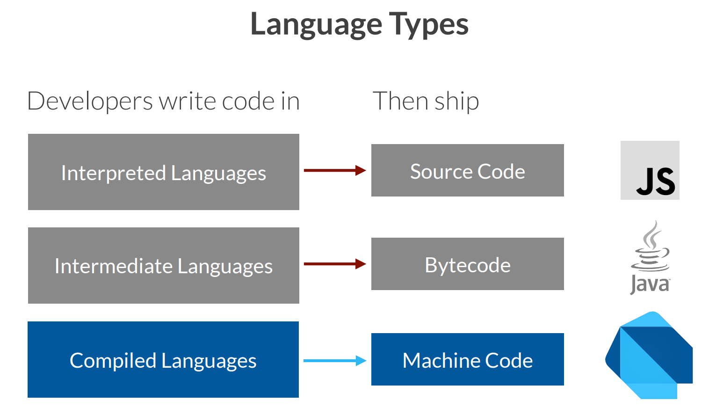

# Frontend Master Cross-Platform Mobile Apps with Flutter

## Mobile Dev and Flutter Overview

If we are a web developer and doing front-end, we can do that using a
framework, such as react and angular, or we can do a native client.

When we make native client, we can use **official SDK**, such as swift for
iOS and kotlin for android, or we can use cross-platform SDK (not from the
platform itself).

The cross-platform SDK let us compile or build an app for several platforms
from the same project, and this is course will explain about this.

These are the top three solution for cross-platform SDK:
- React Native.
- Microsoft Xamarin.
- Flutter.

With flutter, we can build apps for android, apple platforms (mac, iOS, iPadOS), windows, Progressive Web Apps (PWA), and linux.

> Keep in mind that when we are using flutter, we are also making web apps.

## Dart Overview

Dart is a programming language that was created by google. Dart is a
statically typed language, which means we need to compile the code.

> The original intention of Dart was to replace javascript in the browser, but
> it did not work. And nowadays the current intention of Dart is to create
> front-end apps in Flutter and AngularDart.

Dart compiles into native code, intermediate language, and javascript.

We can play around with Dart without installing anything in the website
`dartpad.dev`.

**Every Dart application has a main function**. Dart has full object-oriented
programming with type inference, which mean that **everything will be an
object in Dart**.

**When compiling to the web, the code is going to be executed in the
javascript virtual machine, with the advantages or disadvantages of that**.
This means that the security of our object might not be the same when we are
running our Dart code in a native platform than on the web.

### Language Types

.

Dart will compiles into machine code, which means that we need to compile for
every different platform like ARM, intel, and other architecture.

But, Dart also able to compile into javascript code and bytecode too.

If we are building web apps, we are going to compile Dart to javascript code.

If we are building a desktop apps on linux, macOS, windows, we are going to
compile Dart to bytecode.

If we are building android or iOS apps, we are going to compile Dart to
machine code.

### Variables and Types

#### Variables

There are two ways we can declare variable and types:
- If we know the type or we want to explicitly use the type, we can use the
type name as a prefix, like this:
```dart
int data = 3;
```
- If we don't want to explicitly define the type, we can use `var`, like this:
```dart
var otherData = 5;
```

> If we create a variable with `var` without value, like `var x;`, it becomes
> type dynamic like default type in javascript. Type dynamic means it can be
> anything.
>
> It is a bad practice in dart to create variables with type dynamic, unless
> we have a real use case scenario for using type dynamic.

**Every variable we set with type prefix or `var` is a mutable variable**.
There is also immutable variable, we can use `final` to declare immutable
variable, like this:
```dart
final notImmutable = "final string";
final int otherImmutable = 5;
```

There are also `const` in dart, which is a constant. We can define a constant
like this:
```dart
const pi = 3.14;
```

> The difference between a constant and an immutable variable is that **a
> constant is something we define and set at compilation time** and **an
> immutable variable is a variable, which is a place in memory while our app
> is running, but after the variable was set, it can not be changed**. We
> don't need to have a value at compile time for immutable variable. As for
> constant, we need a value at compile time.

#### Types

> Everything is an object in dart.

We have basic type that start with lowercase, like this:
```dart
int
double
bool
dynamic
num
```

Except for string, string start with uppercase, like this:
```dart
String
```

> `double` and `int` are inheriting from `num`. So `num` is like a general
> type for number.

If we make our own type, the guideline is to start with uppercase.

#### Strings

For string, we can use double quote or single quote. There is no difference
using a double quote or single quote.

We can make a multi-line string with triple double quote like this:
```dart
var multiline = """
example
of
multi-line
strings
""";
```

We can also use `$` to replace templates with variables or expressions, like
this:
```dart
var price = 3;
var otherPrice = 5.2;

var message = "The price is $price and ${otherPrice * 1:1}";
```

### Collections and Null Safety

#### List

In dart, there are many collections. We have list, which is kind of an array,
we declare list type with `List<expected-type>`. For example, if we want a
list of strings, we can declare the type like this `List<String>`. We
initialize a list with json syntax, like this:
```dart
List<String> countries = ["japan", "singapore", "indonesia"];
```

#### Set

A set use curly brackets for the list, instead of square bracket. The
difference between a set and a list is that, a set will not accept repetitions
and there is no actual order.
```dart
var alpha = { "a", "b", "c" };
```

#### Map

Map is similar to a dictionary or an object in json, the difference between
map and json is that, the keys does not need to be a string, we can put a
number, boolean, or even another object. Here is an example of map:
```dart
var readMap = { "anu": 69, "itu": "ngitu" };
```

The type for `readMap` is `Map<String, Object>`.

#### Null Safety

Null safety is not by default in dart, but it is by default in flutter.

The idea of null safety is that, when we create a variable with value, like
this:
```dart
String myname;
```

If we don't set the value, it won't compile because we need to initialize the
value. We can't also assign `null` to `myname` variable.

If we want to assign the value later, we can use `late` like this:
```dart
late String myname;
```

And we are responsible of setting up the value before using the variable. If
we try to use the variable without a value, it will crash the app or exception
on the web.

Or we can define a semantic nullable type, like this:
```dart
String? myLastname;
```

But there is a problem with semantic nullable type. Because there is a
possibility that the type is null, we can't use the method or property
associated with the original type.

Dart offer us two ways to solve this problem:
- null manual override, which assume the variable is not null. Here's an
example:
```dart
final lengthForSure = myLastname!.length;
```

- safe calls, which means that if the variable null, it's not going to execute
the method or property associated with the original type. Here's an example:
```dart
// the type of length variable is int?
var length = myLastname?.length;
```

### Functions and Lambdas

#### Functions

We can define a function like this:
```dart
aFunction() {
  print("It's a function.");
}
```

We can also specify a return type with a function like this:
```dart
void explicitVoidReturnType() {
  print("It's a function with void return type.");
}

String explicitStringReturnType() {
  return "It's a function with string return type.";
}
```

> `void` is the default return type if we don't specify the return type.

If we want to return a list from a function, we do it like this:
```dart
List<int> createList() {
  return [6, 9, 4, 2, 0];
}
```

#### Arguments

We can define a arguments in a function like this:
```dart
int sum(int a, int b) {
  return a + b;
}
```

**We need to define the type of the arguments too**.

#### Named Arguments

A named arguments are optional by default, if we want to make it required, we
can add `required` keyword before the type.

Here is an example:
```dart
printCustomer(String name, double balance, {required bool isActive}) {
  print(name);
  print("$balance");
  print(isActive);
}

callPrint() {
  printCustomer("Anu", 200, isActive: false);
}
```

We can't change the named arguments with another name. In the example above,
we can't change named argument `isActive` with `active` because it's a part of
the argument.

#### Lambda or Anonymous Functions

We can declare a lambda or anonymous function with a type `Function` like
this:
```dart
Function myFunction = (int a, int b) {
  // this is a variable containing a function.
  return a + b;
};
```

We also have arrow anonymous function in dart, like this:
```dart
Function myArrowFunction = (int a, int b) => a + b;
```

The difference is that, we can only arrow function with one return expression.
If we have multiple expression, we need to use code block.

Why we need a semicolon in lambda or anonymous functions but not in regular
function?

Because with lambda or anonymous function, the it's considered a declaration
of a variable rather than a function. With variable declaration, we need a
semicolon, meanwhile with a function declaration, we don't need a semicolon.

## Classes

Dart is an Object-Oriented Programming language so that means everything is a
class.

We can declare a class like this:
```dart
class Person {
  // property
  int id = 0;
  // function
  show() {
    print("Person id: ${this.id}");
  }
}
```

We can create an object from those class with the two syntax here:
```dart
// the `new` keyword is optional.
final p = Person(); // this is the flutter way!
final q = new Person();
```

What about the primary constructor? It is the constructor that have a class
name like this:
```dart
class Request {
  int id = 0;
  String url = "";

  Request(int id, String url) {
    this.id = id;
    this.url = url;
  }
}
```

The downside is that, we can't create another primary constructor.

If we want to create more constructors, we need to create a named constructor
like this:
```dart
class Request {
  int id = 0;
  String url = "";

  Request(int id, String url) {
    this.id = id;
    this.url = url;
  }

  // named constructor.
  // typically we start the named constructor with `from`.
  Request.fromData(this.id, this.url);
}
```

We have shortcut for the primary constructor arguments in dart, like this:
```dart
class Request {
  int id = 0;
  String url = "";

  // if we don't have any expression inside of a primary constructor, we can
  // replace the curly brackets with semicolon.
  Request(this.id, this.url);
}
```

We can use inheritance with `extends` keyword like this:
```dart
class HttpRequest extends Request {
  // this is extending from the super constructor.
  HttpRequest(int id, String url) : super(id, url);
}
```

## Flutter

Flutter is a declarative UI framework which is similar to React Native,
Swift UI, Jetpack Compose, where we declare the UI in one expression.

Flutter focus on modern UI patterns which is:
- Single Source of Truth (the data reside only in one place).
- Composable component (we're going to called this widgets).
- Multiplatform.
- Dependency Rendering (our widgets have dependencies on variables,
properties, states that will define how our widgets being rendered).
- Data binding and reactive programming.
- UI expressed in widgets and widgets is just a Dart class.

Flutter comes with two set of widgets:
- Material
- Cupertino (iOS-like widget)

Flutter is competing in the same group such as React Native. The difference
between React Native and Flutter is that, when we create a button on the
screen, the button instance is from the UI toolkit from each OS while Flutter
is not using any UI framework from the OS, it's rendering its own button in a
low level canvas.

> Flutter only support `snake_case` or `nounderscore` for the project name.

### Flutter Project Directory Structure

- `android` directory contain android studio project that will be compiled by
flutter into flutter app.

- `ios` directory contain an xcode project that will be compiled by flutter
into flutter app.

> Everytime we build an app in Flutter, it's not going to change the content
> in `android` and `ios` directory which means it's safe to edit file in those
> directory.

- `build` directory contain the final build of flutter app.

- `web` directory contains a project of our web app.

- `test` directory contain the unit test for our app.

- `windows` directory contain a project of windows app.

- `lib` directory contain source code for the app (this is where we store our
dart files).

- `pubspec.yaml` is similar to `package.json` in nodejs project.

## Widgets

Flutter is heavily based on the concept of widget. A widget is basically
something that decides how to render content on the screen.

A widget is a class that extends from Widget class, but the Widget class is
abstract so we can't actually extends from the Widget class directly. Here's
an example:
```dart
class HelloWorld extends StatelessWidget {
  // we need a constructor that receive a key and passing that key to the
  // super class.
  const HelloWorld({Key? key}): super(key: key);

  @override
  Widget build(BuildContext context) {
    return const Text("Hello world");
  }
}
```

> The stateless widget will never change because it does not contain a state.
> If we want a widget to contain a state, we can use a stateful widget.

## Extra Notes

In Dart, there is a `print()` function that will print to the console. But,
please keep in mind that on different platform, the console means different
things. On android and iOS, there is an output console which is different from
the screen. On the web, the console is the web browser's console.

We can't have a global code, everything must be in a function or class.

We use camelCase for the function name in Dart.

Everything that we are doing in a project, by default it is a package and we
can have more than one package. A package is like a directory, if we want to
use from other package, we need to import the package.

By default, everything in package is public, but if we prefix the name with
`_` (underscore), it will become private. Here is an example:
```dart
class X {
  String _privateProperty = "";
}
```

Data types, such as class, use TitleCase.

`void` is a data type and data type is not an object. We can't have value of
type `void` so we can't have void object.

**There's one rule to changing the state, the change must happen within a set of
a state call**.

## References

- [Frontend master course](https://frontendmasters.com/courses/flutter/).
- [Course website](https://firtman.github.io/intro-flutter/).
- [Playing around with dart](https://dartpad.dev/).
